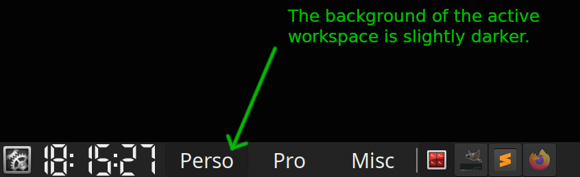
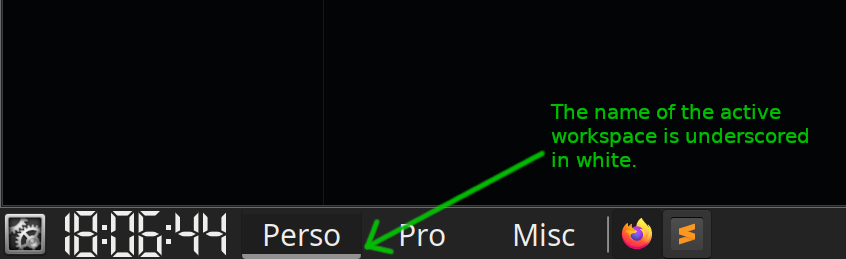

# Xfce4 Workspace Indicator
This CSS file adds an indicator to the Xfce4 workspace panel widget, on Linux. The colour and thickness of the indicator can be configured by editing the CSS file directly.

## Screenshots
### Before



### After



## Installation
Edit the file located at ~/.config/gtk-3.0/gtk.css. If it doesn't exist yet, then you will have to create it:

```
mkdir -p  ~/.config/gtk-3.0
cd ~/.config/gtk-3.0
wget --no-check-certificate --content-disposition https://raw.githubusercontent.com/Kimonode/xfce4_worspace_indicator/main/gtk.css
```

To see your modifications applied, you can reset the xfce4-panel process by typing the following command into a terminal:

```
xfce4-panel -r
```

## Debug
If you need to debug, follow the instructions from the [Xfce documentation](https://docs.xfce.org/xfce/xfce4-panel/theming#gtk3_theme_testing_and_debugging).
